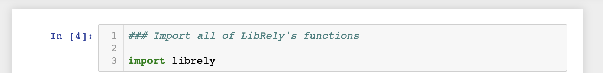
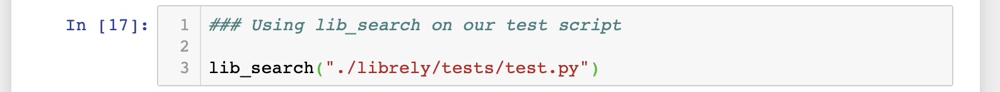
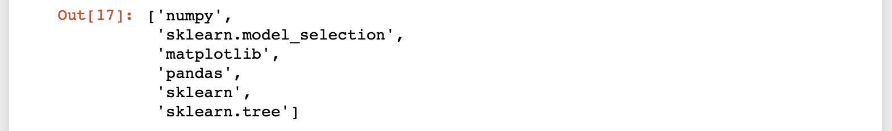
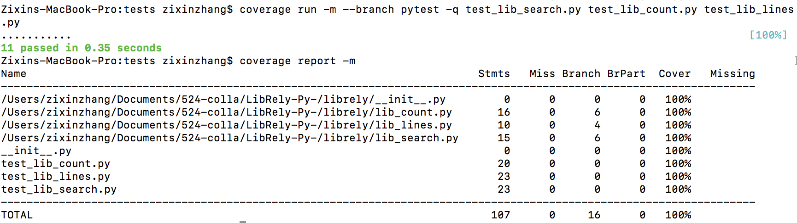
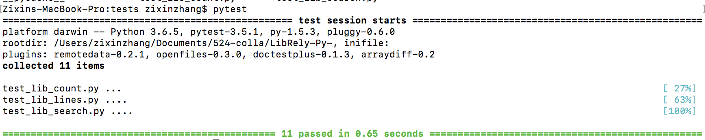

# LibRely (Python)

[](https://travis-ci.org/UBC-MDS/LibRely-Py-)
_____
### Collaborators
| Name | GitHub Handle |
| ---- | ------ |
| Alex Hope | [@ehhope ]( https://github.com/ehhope) |
| Zixin Zhang     | [@zxzzhangg](https://github.com/zxzzhangg) |
| Aaron Quinton     | [@aaronquinton](https://github.com/aaronquinton ) 

### Releases

[Milestone 1 Release](https://github.com/UBC-MDS/LibRely-Py-/releases/tag/V1.0)

[Milestone 2 Release](https://github.com/UBC-MDS/LibRely-Py-/tree/2.0)
___

### Overview
The `LibRely-Py-` package is designed to provide an understanding of python scripts by retrieving any packages, functions, and size characteristics contained in the file. This is often helpful in data science workflows when developing pipelines, as well as for software development projects where knowing the contents of other scripts is helpful in developing one the user may be currently working on or chaining to. The functionalities in this package interpret scripts to compile module dependencies, document specific functions imported in the script and measure the length of the script by the number of lines and characters.

The user can import `Librely` to better understand the packages used in a script authored by someone else. Alternatively, a user can take advantage of the functionalities when preparing the ```README``` documentation in their project or when building scripts that they intend to connect to on another in an analysis pipeline. The following functions are included in the `Librely` package.

`lib_search()`

- Input parameter(string): a file path to the script
- Output parameter(list): a list of dependencies
- Function purpose: It finds and lists the modules used in the python script

`lib_count()`

- Input parameter(string): a file path to the script
- Output parameter(tuple): A tuple of two lists, 1) dependencies 2) functions
- Function purpose: It retrieves functions specifically imported from a package and details the libraries/packages contained as well.

`lib_lines()`

 - Input parameter(string): a file path to the script
 - Output parameter(print statements): a list of two numbers, one for the number of lines and one for the number of characters
 - Function purpose: It counts the number of lines and characters of the script to provide a sense of the size.


### Installation and Use
To install ```Librely``` on your own device using ```pip```, type this in your terminal:

```pip install git+https://github.com/UBC-MDS/LibRely-Py-.git```


- To use the ```Librely``` package in python, you can import the entire package by writing into your text editor/jupyter notebook:

``` import librely```

- If you are interested in only using a specific function such as```lib_count``` you can call it specifically by writing in your text editor/jupyter notebook:

``` from librely.lib_count import lib_count```

##### Use Case Example

Here we will show you how to use ```Librely```'s function ```lib_search```, which extracts dependencies from a script. In this repository you will find a python script called ```test.py``` containing several dependencies that the test script calls in order to perform varous tasks. We will reference the filepath of the test script in this repository when using ```lib_search```. For your purposes, as long as the filepath is specified for the function, it will evaluate it's contents appropriately. Here is a case example shown in a jupyter notebook:

- Let's import all of ```Librely```'s functions:




- Let's pick the function ```lib_search``` to extract dependencies from a test script located in a separate folder (tests folder of this repository if you are curious):




- Finally, let's extract and deliver the output list of modules from our "test.py" file:





### Branch Coverage Test
You can go to `librely/tests` and run the following command lines in terminal
```
coverage run -m --branch pytest -q test_lib_search.py test_lib_count.py test_lib_lines.py
coverage report -m
```
The results are shown below.



### Test result
To test all the tests function, run `pytest` in terminal. The results are shown below.


### Python Ecosystem

- **Python**: We were not able to find any Python software packages that address the same functionality as we intend to with ```Librely```, however, a package called [meta_func](https://pypi.org/project/meta_func/) does keep track of metadata about function use in a given script you examine.

#### Package Fit
Due to the lack of python packages available for analyzing script qualities, we feel LibRely has something unique to offer the Python ecosystem. It grants quick access to relevant information about the contents of scripts and offers insight into the actions being performed. If anyone wants to get a sense of a longer pipeline, they can simply import ```Librely``` and use it's distinct functions on different scripts that may be linked together in a pipeline. For these reasons, we feel ```Librely``` is an interesting and useful package for the user and a meaningful addition to the Python ecosystem.
